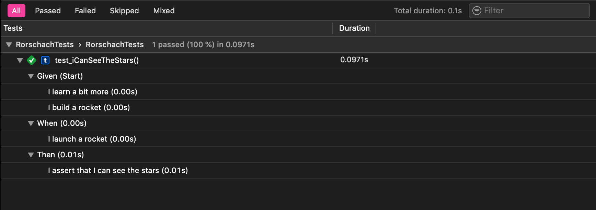

# Rorschach Tests

This package allows you to write tests in a BDD style. It's Swift's function builders that allow for a lightweight DSL that makes your tests way more readable.

```swift
func test_iCanSeeTheStars() {
    var context = UniverseContext()

    expect(in: &context) {
        Given {
            ILearnABitMore()
            IBuildARocket()
        }
        When {
            ILaunchARocket()
        }
        Then {
            ICanSeeTheStars()
        }
    }
}
```

---

 
