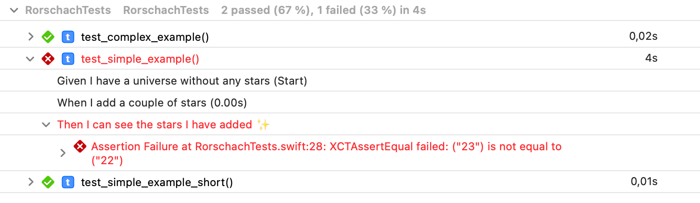

 


**This package allows you to write tests in a BDD style.** 

It's Swift's result builders that allow for a lightweight DSL that makes your tests way more readable.


Take a look at the following example:

```swift
func test_simple_example() {

    let context = UniverseContext()

    expect {
        Given("I have a universe without any stars") {
            context.numberOfStars = 0
        }
        When("I add a couple of stars") {
            context.numberOfStars = 23
        }
        Then("I can see the stars I have added ✨") {
            XCTAssertEqual(context.numberOfStars, 23)
        }
    }
}
```

Please note that the contents of each step like `context.numberOfStars = 23` for example, are arbitrary Swift code - you are free to add your abstractions on a Page Object Model or the like as you need them.

The test run leads to this result in Xcode's Report Navigator. An easy to read output that can easily be understood in case of a failure.




---

Contributions are much appreciated. Any kind of feedback about whether or not this is helpful for you or if you want to share ways to improve _Rorschach_ are highly welcome. Reach out on Twitter to [q231950](https://twitter.com/q231950) or [create a new issue](https://github.com/q231950/rorschach/issues/new).

