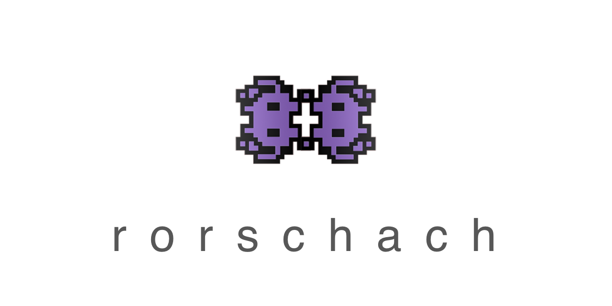
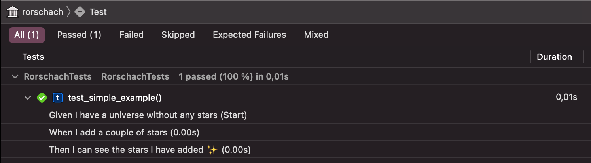

 


This package allows you to write tests in a BDD style. It's Swift's result builders that allow for a lightweight DSL that makes your tests way more readable.

```swift
func test_simple_example() {

    let context = UniverseContext()

    expect {
        Given("I have a universe without any stars") {
            context.numberOfStars = 5
        }
        When("I add a couple of stars") {
            context.numberOfStars = 1_000_000_000_023
        }
        Then("I can see the stars I have added ✨") {
            XCTAssertEqual(context.numberOfStars, 1_000_000_000_023)
        }
    }
}
```

---

 
